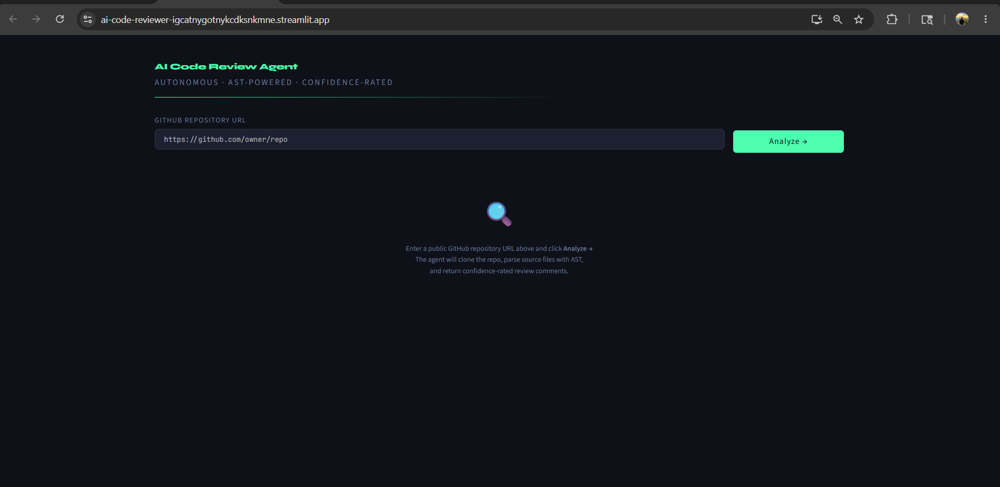
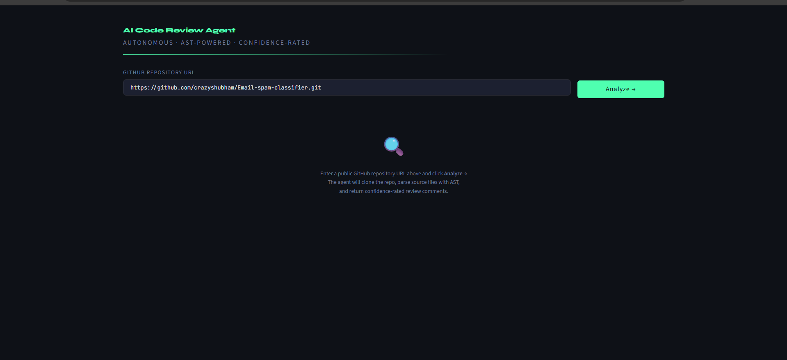
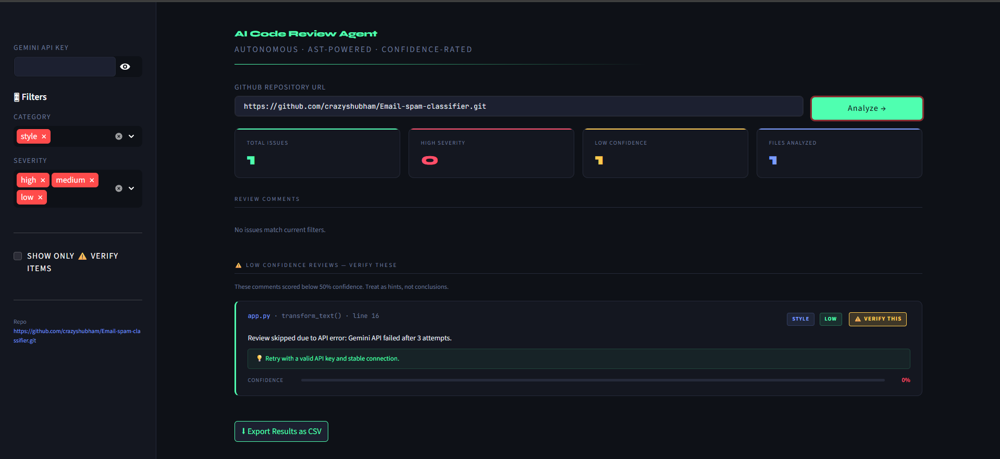

# 🔍 AI Code Review Agent

> Autonomous · AST-Powered · Confidence-Rated

## 📸 Screenshots






---

## 📌 Project Overview

An end-to-end agentic AI pipeline that autonomously reviews GitHub repositories and outputs actionable, confidence-rated review comments via an interactive dashboard.

The agent:
1. **Clones** any public GitHub repository using GitPython
2. **Parses** Python and JavaScript source files using AST and regex
3. **Reviews** each function using Google Gemini AI
4. **Displays** structured comments with severity ratings and confidence scores

Every comment includes a self-rated confidence score (0–100%). Low-confidence comments are shown separately with a ⚠️ **VERIFY THIS** label.

---

## 🖥️ Live Demo

🔗 [https://crazyshubham-ai-code-reviewer.streamlit.app](https://crazyshubham-ai-code-reviewer.streamlit.app)

---

## 📸 Screenshots

<!-- Add your screenshots in a /screenshots folder in the repo -->

| Dashboard | Review Comments |
|-----------|----------------|
|  |  |

---

## 🏗️ Architecture

```
GitHub URL
    │
    ▼
┌─────────────┐
│ ingestion.py│  ← Clones repo with GitPython (depth=1)
│             │    Reads .py / .js files
└──────┬──────┘
       │
       ▼
┌─────────────┐
│  parser.py  │  ← Python: ast module (functions, classes, imports)
│             │    JavaScript: regex-based extraction
│             │    Chunks large files (>100 lines) into 50-line blocks
└──────┬──────┘
       │
       ▼
┌─────────────┐
│ reviewer.py │  ← Sends each function to Google Gemini API
│             │    Returns JSON: category, severity, comment,
│             │    suggestion, confidence (0–100)
└──────┬──────┘
       │
       ▼
┌──────────────┐
│ dashboard.py │  ← Streamlit UI with filters, metric cards,
│              │    confidence bars, CSV export
└──────────────┘
```

---

## ⚙️ Setup Instructions

### 1. Clone the repository
```bash
git clone https://github.com/crazyshubham/ai-code-reviewer
cd ai-code-reviewer
```

### 2. Create and activate virtual environment
```bash
python -m venv .venv

# Windows
.venv\Scripts\activate

# Mac/Linux
source .venv/bin/activate
```

### 3. Install dependencies
```bash
pip install -r requirements.txt
```

### 4. Get a free Gemini API key
- Go to [https://aistudio.google.com/apikey](https://aistudio.google.com/apikey)
- Create a new API key (free, no credit card needed)

### 5. Run the app
```bash
streamlit run dashboard.py
```

### 6. Enter your Gemini API key in the sidebar and paste any public GitHub URL

---

## 📦 Tech Stack

| Component | Technology |
|-----------|-----------|
| Ingestion | GitPython |
| Parsing | Python `ast` module + Regex |
| LLM Review | Google Gemini 2.5 Flash |
| Orchestration | Python (custom pipeline) |
| Dashboard | Streamlit |
| Deployment | Streamlit Cloud |

---

## ⚠️ Known Limitations

- Only supports `.py` and `.js` files (no Go, Rust, Java etc.)
- JavaScript parser is regex-based, not a full AST (may miss edge cases)
- Private GitHub repositories are not supported
- Free Gemini API tier has rate limits (15 requests/minute)
- Large repositories with many functions may take 1–2 minutes to analyze
- API key must be entered each session (not stored for security)

---

## 🚀 What I Would Build Next

- **GitHub PR Integration** — automatically post review comments on pull requests
- **More Languages** — Go, Rust, Java, TypeScript support via tree-sitter
- **Caching** — cache results per repo+commit hash to avoid re-reviewing unchanged code
- **Parallel reviews** — review multiple functions simultaneously to speed up analysis
- **Diff mode** — only review changed functions in a PR, not the entire repo
- **Historical tracking** — store past reviews in a database to track code quality over time

---

## 📁 Project Structure

```
ai-code-reviewer/
├── ingestion.py       # Step 1: Clone and read repository files
├── parser.py          # Step 2: AST parsing and code structure extraction
├── reviewer.py        # Step 3: LLM-powered code review via Gemini
├── dashboard.py       # Step 4: Streamlit UI dashboard
├── requirements.txt   # Python dependencies
└── README.md          # This file
```

---

## 📜 Academic Integrity

AI assistants were used to help write individual code snippets. All architecture decisions, prompt design, and integration logic were made independently. All code is understood and can be explained in a viva/demo.

---

## 👤 Author

**Shubham Upadhyay**  
[github.com/crazyshubham](https://github.com/crazyshubham)
